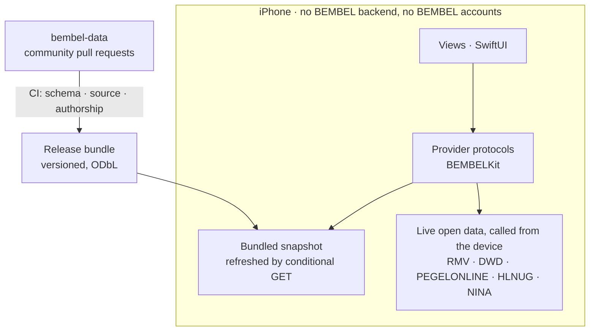

# 🍎 BEMBEL

**A free iPhone city app for Frankfurt and Rhein-Main.** Für eine Stadt, die
heißer wird — Wasser, Luft, Regen. Frankfurt already publishes what you need on
a hot afternoon: where the water is, what the air is doing, whether the rain is
about to arrive. It publishes it in formats you cannot use while standing on a
street corner. BEMBEL puts it in one place.


[](LICENSE)


[](https://github.com/maurice-jobst/bembel/actions/workflows/ci.yml) [](https://github.com/maurice-jobst/bembel/actions/workflows/data-validate.yml)

No ads, no tracking, no BEMBEL backend, no BEMBEL accounts. Apple services
(Game Center, iCloud) and GitHub participation are opt-in. The App Store
privacy label says "Data Not Collected", and that holds. Named after the
Apfelwein jug: grey salt-glazed stoneware, cobalt diamond relief.

## 🥤 The hero: community data, wie Yelp, nur in GitHub

The flagship is the **Wasserhäuschen-Register**, with the **Ebbelwei-Wirtschaften
register** alongside it. Both run on [bembel-data](https://github.com/maurice-jobst/bembel-data),
where entries and ratings arrive as pull requests.

- **Provenance over anonymity.** Every entry shows who verified it, when, and
  from which source. One tap opens its full GitHub history.
- **Ratings you can trust.** One rating per GitHub account per entry, enforced
  by CI: [`check_authorship.py`](https://github.com/maurice-jobst/bembel-data/blob/main/scripts/check_authorship.py)
  rejects any pull request touching a rating file named for someone else, and
  maintainers get no proxy path around it.
- **The app is the funnel.** "Bewerten" opens a prefilled GitHub flow for that
  kiosk, and contributors earn in-app sticker credit (Datenspender).
- **Shipped.** Both registers live in the **Orte** tab, first in the tab bar
  ([ADR 0009](docs/adr/0009-registers-in-one-places-tab.md)): Merkmale-first
  navigation, a provenance byline per entry, coverage per Stadtteil, stickers.

## 📱 v1.0

| Feature | Data source |
|---|---|
| **Wasserhäuschen-Register** with ratings, Merkmale, provenance, rating funnel, coverage game | [bembel-data](https://github.com/maurice-jobst/bembel-data) (community, ODbL) |
| **Ebbelwei-Wirtschaften register** | [bembel-data](https://github.com/maurice-jobst/bembel-data) |
| Sticker: Datenspender/Verifizierer/Erste-Bewertung, plus Kiosk-Stempel | contributors.json + on-device visits |
| RMV departures with Home/Lock Screen widgets | RMV Open Data API |
| Sonnenstand: where the sun is, with a time scrubber | NOAA solar position, computed on device |
| Free drinking water, with seasonal state engine | Frankfurt Geoportal, OSM, Refill |
| Rain radar | DWD open data (RADOLAN, parsed on-device) |
| Stadtzustand: Main level, air quality, temperature, civil warnings | PEGELONLINE, HLNUG, DWD, NINA |

The Schattenkarte — an on-device shadow map over the Hessen LoD2 building
model — is **not** in v1.0: its geometry ships as a published dataset, the
rendering is the v1.2 headline
([ADR 0010](docs/adr/0010-portfolio-artefact-over-product.md)). Ship target:
22 March 2027 (World Water Day); English localization is v1.1. Scope of record:
one [GitHub Issue](https://github.com/maurice-jobst/bembel/issues) per ticket,
indexed by epic in [docs/BACKLOG.md](docs/BACKLOG.md); post-1.0 side quests are
[milestone M4](https://github.com/maurice-jobst/bembel/milestone/5).

## 🏗️ Architecture



- **iOS 18.5+, SwiftUI, iPhone only.** Plain Xcode project, no generators, no
  third-party dependencies, German-first String Catalogs. Three targets:
  `BEMBEL` (app), `BEMBELWidgets` (widget extension) and `BEMBELKit`, a local
  Swift package with the design system, navigation, region model and data layer.
- **No backend.** Curated datasets are bundled and refreshed via conditional
  GET against a static manifest; live APIs are called straight from the device.
- **Provider seam** ([ADR 0007](docs/adr/0007-provider-seam.md)): each feature
  reads a protocol from BEMBELKit; fixtures and live sources are interchangeable
  behind it, so going live never touches a view.

### 🗂️ The source registry

Every upstream this app reads is in [`data/sources.json`](data/sources.json):
34 entries across the Frankfurt Geoportal, DWD, the Autobahn GmbH, Open Data
Hessen, GBFS operators and more — each with its licence, polling cadence, the
date a live request last proved it works, and the gotchas that cost an hour.
Sources are tiered 1–5 by what access costs, and the tier is a claim the
validator enforces — tier 1–2 must be keyless, and a tier-5 entry records the
search that found no API rather than an endpoint. The tier-5 block is the part
most registries leave out: six things Frankfurt does *not* publish, written
down so nobody spends another afternoon looking.

```bash
make verify-sources   # calls all 50 endpoints, reports dead ones and collapsed feature counts
```

A [weekly job](.github/workflows/sources-liveness.yml) runs the same sweep and
files one issue when an upstream stops answering or a layer quietly empties out.

## 🤖 How it is built

AI agents write the implementation; a human reviews every pull request; CI
takes what a reviewer should not have to check by hand — formatting, schema
conformance, data provenance. That split, **AI at the edges, deterministic
core**, also decides technical questions: given two options a human would rate
the same, we take the one an agent can work in safely
([ADR 0008](docs/adr/0008-ai-native-selection-principle.md)).

| Gate | What runs |
|---|---|
| Format | `make format-check`, swift-format bundled with Xcode |
| Tests | `swift test` on BEMBELKit, natively on macOS, no simulator |
| App build | `xcodebuild`, iOS Simulator, unsigned |
| Data | `make validate`: schemas, generated-file equality, source URLs, README numbers |
| Upstreams | `make verify-sources`, weekly: every registered open-data endpoint called for real |
| Community data | schema and authorship checks in [bembel-data](https://github.com/maurice-jobst/bembel-data) |

[docs/AI-NATIVE.md](docs/AI-NATIVE.md) is the long version: which constraints
this repo accepted so that agent-written changes stay reviewable, each pointing
at the file or check that enforces it — and what got through the gates anyway.
Decisions that would be expensive to reverse live in [docs/adr/](docs/adr/).

## 🔨 Building

Xcode 16.4+ (iOS 18.5 SDK). `BEMBELKit` also compiles for macOS, so `swift
test` runs natively without a simulator; there is no Mac app.

```bash
cp Config/Secrets.xcconfig.template Config/Secrets.xcconfig
# fill in BEMBEL_TEAM_ID (and later RMV_API_KEY); the file is gitignored
make build         # xcodebuild, iOS Simulator, no signing
make test          # BEMBELKit unit tests via swift test
make validate      # data schema validation
make format        # swift-format (bundled with Xcode); run before pushing
```

## 👥 Team and licences

PM and architecture: [@maurice-jobst](https://github.com/maurice-jobst). App and
widgets: [@cybeerboy](https://github.com/cybeerboy). Data pipeline and CI: [@jaypikay](https://github.com/jaypikay),
[@monsdroid](https://github.com/monsdroid). Working agreement: [CONTRIBUTING.md](CONTRIBUTING.md).

Code is [MIT](LICENSE). Bundled data carries its sources' licences, attributed
in `data/ATTRIBUTION.json` and rendered in-app; OSM-derived datasets are ODbL
(share-alike). [ai-workbench](https://github.com/maurice-jobst/ai-workbench)
applies the same doctrine to knowledge work.
