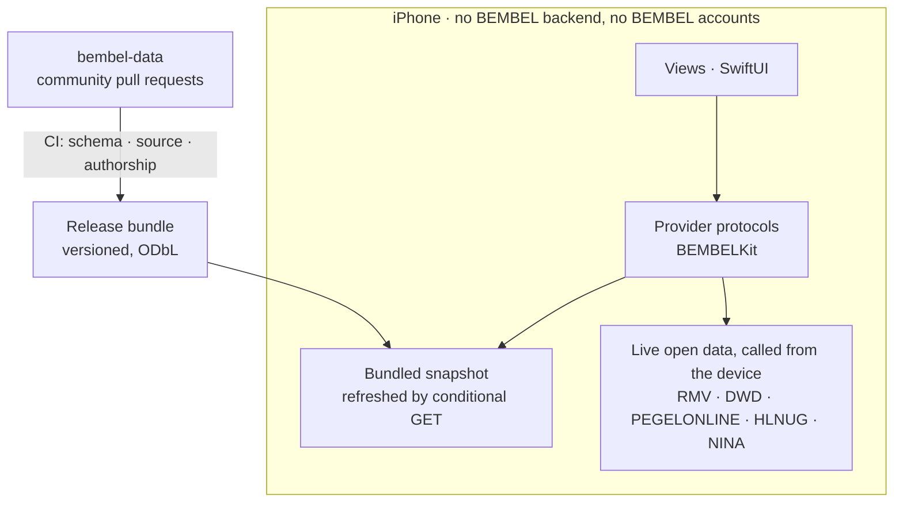

# 🍎 BEMBEL

**A free iPhone city app for Frankfurt and Rhein-Main.** Frankfurt already
publishes what you need on a hot afternoon: where the shade falls, where the
water is, what the air is doing. It publishes it in formats you cannot use
while standing on a street corner. BEMBEL puts it in one place.


[](LICENSE)


<!-- At the v1.0 public flip: add the CI and data-validation status badges.
     shields.io and GitHub's own badge.svg cannot read a private repo. -->

No ads, no tracking, no BEMBEL backend, no BEMBEL accounts. Apple services
(Game Center, iCloud) and GitHub participation are opt-in. The App Store
privacy label says "Data Not Collected", and that holds.

Named after the Apfelwein jug: grey salt-glazed stoneware, cobalt diamond
relief.

## 🥤 The hero: community data, wie Yelp, nur in GitHub

BEMBEL's flagship is the **Wasserhäuschen-Register**, with the
**Ebbelwei-Wirtschaften register** alongside it. Both run on
[bembel-data](https://github.com/maurice-jobst/bembel-data), where entries and
ratings arrive as pull requests.

- **Provenance over anonymity.** Every entry shows who verified it, when, and
  from which source. One tap opens its full GitHub history.
- **Ratings you can trust.** One rating per GitHub account per entry, enforced
  by CI: [`check_authorship.py`](https://github.com/maurice-jobst/bembel-data/blob/main/scripts/check_authorship.py)
  rejects any pull request touching a rating file named for someone else, and
  maintainers get no proxy path around it. We have not found this trust model
  built out of GitHub primitives anywhere else.
- **The app is the funnel.** "Bewerten" opens a prefilled GitHub flow for that
  kiosk, and contributors earn in-app sticker credit (Datenspender). No BEMBEL
  accounts, no backend, and the privacy label stays "Data Not Collected".
- **Built and shipped.** Both registers live in the **Orte** tab, first in the
  tab bar ([ADR 0009](docs/adr/0009-registers-in-one-places-tab.md)): Merkmale
  as the navigation, a provenance byline on every entry, coverage per
  Stadtteil, and the Sammlung with data-linked stickers and opt-in kiosk visit
  stamps.

## 📱 v1.0

| Feature | Data source |
|---|---|
| **Wasserhäuschen-Register** with ratings, Merkmale, provenance, rating funnel, coverage game | [bembel-data](https://github.com/maurice-jobst/bembel-data) (community, ODbL) |
| **Ebbelwei-Wirtschaften register** | [bembel-data](https://github.com/maurice-jobst/bembel-data) |
| Sticker: Datenspender/Verifizierer/Erste-Bewertung, plus Kiosk-Stempel | contributors.json + on-device visits |
| RMV departures with Home/Lock Screen widgets | RMV Open Data API |
| Schattenkarte, an on-device shadow map with time scrubbing | Hessen LoD2 building model (DL-DE Zero) |
| Free drinking water, with seasonal state engine | Frankfurt Geoportal, OSM, Refill |
| Rain radar | DWD open data (RADOLAN, parsed on-device) |
| Stadtzustand: Main level, air quality, civil warnings | PEGELONLINE, HLNUG, NINA |

Ship target: 22 March 2027 (World Water Day). Scope of record:
[hero-repositioning spec](docs/superpowers/specs/2026-08-13-hero-repositioning-design.md).

## 🏗️ Architecture



- **iOS 18.5+, SwiftUI, iPhone only.** Plain Xcode project, no generators.
- Three targets: `BEMBEL` (app), `BEMBELWidgets` (widget extension), and
  `BEMBELKit`, a local Swift package holding the design system, navigation,
  region model and data layer.
- **No backend.** The build bundles the curated datasets, and the app refreshes
  them at runtime via conditional GET against a static manifest. It calls the
  live APIs (RMV, DWD, PEGELONLINE, HLNUG, NINA) straight from the device.
- **Provider seam** ([ADR 0007](docs/adr/0007-provider-seam.md)): each feature
  reads a protocol from BEMBELKit. Today those protocols return sample
  fixtures, and we swap in live sources one at a time without touching views.
- No third-party dependencies.
- German is the base language, and all strings go through String Catalogs.

[docs/adr/](docs/adr/) records the decisions that would be expensive to
reverse. [docs/BACKLOG.md](docs/BACKLOG.md) holds the spec: scope, rationale,
acceptance criteria. [GitHub Issues](https://github.com/maurice-jobst/bembel/issues)
and [Milestones](https://github.com/maurice-jobst/bembel/milestones) carry
day-to-day status (M0 Skeleton → M1 Pipeline & geometry → M2 Features →
M3 Ship).

## 🤖 How it is built

AI agents write the implementation. A human reviews every pull request. CI
takes what a reviewer should not have to check by hand: formatting, schema
conformance, and the data-provenance rules. That split is the doctrine this
project runs on, **AI at the edges, deterministic core**, and it also decides
technical questions. Given two options a human would rate the same, we take the
one an agent can work in safely
([ADR 0008](docs/adr/0008-ai-native-selection-principle.md)).

| Gate | What runs |
|---|---|
| Format | `make format-check`, swift-format bundled with Xcode |
| Tests | `swift test` on BEMBELKit, natively on macOS, no simulator |
| App build | `xcodebuild`, iOS Simulator, unsigned |
| Data | `make validate`: schemas, generated-file equality, source URLs |
| Community data | schema and authorship checks in [bembel-data](https://github.com/maurice-jobst/bembel-data) |

## 🔨 Building

Requires Xcode 16.4+ (iOS 18.5 SDK).

```bash
cp Config/Secrets.xcconfig.template Config/Secrets.xcconfig
# fill in BEMBEL_TEAM_ID (and later RMV_API_KEY) — the file is gitignored
make build         # xcodebuild, iOS Simulator, no signing
make test          # BEMBELKit unit tests via swift test (no simulator needed)
make validate      # data schema validation
make format        # swift-format (bundled with Xcode) — run before pushing
make format-check  # the same check CI runs
```

`BEMBELKit` also compiles for macOS, so `swift test` runs natively on any
machine and in CI without booting a simulator. There is no Mac app.

## 🔭 Beyond 1.0

The horizon is
[milestone M4, side quests](https://github.com/maurice-jobst/bembel/milestone/5):
the full Sticker-Sammelalbum (city-hotspot geofences, Game Center, seasonal
drops; the data-linked stickers ship in 1.0), GrünGürtel walks, Baumkataster,
Stolpersteine, Blaulicht-Archiv, and more. English localization is v1.1.

## 👥 Team

Three lanes. PM and architecture:
[@maurice-jobst](https://github.com/maurice-jobst). Frontend, meaning app and
widgets: [@cybeerboy](https://github.com/cybeerboy). Backend, meaning the data
pipeline, `data/`, `scripts/` and CI:
[@jaypikay](https://github.com/jaypikay) and
[@monsdroid](https://github.com/monsdroid). See
[CONTRIBUTING.md](CONTRIBUTING.md) for the working agreement.

## ⚖️ Licences

Code is [MIT](LICENSE). Bundled data carries its sources' licences, attributed
in `data/ATTRIBUTION.json` and rendered in-app. Datasets derived from
OpenStreetMap are ODbL, which is share-alike.

---

Maurice Jobst leads this as PM and architect. His
[entity home](https://maurice-jobst.github.io/) has the wider context, and
[ai-workbench](https://github.com/maurice-jobst/ai-workbench) applies the same
doctrine to knowledge work.
