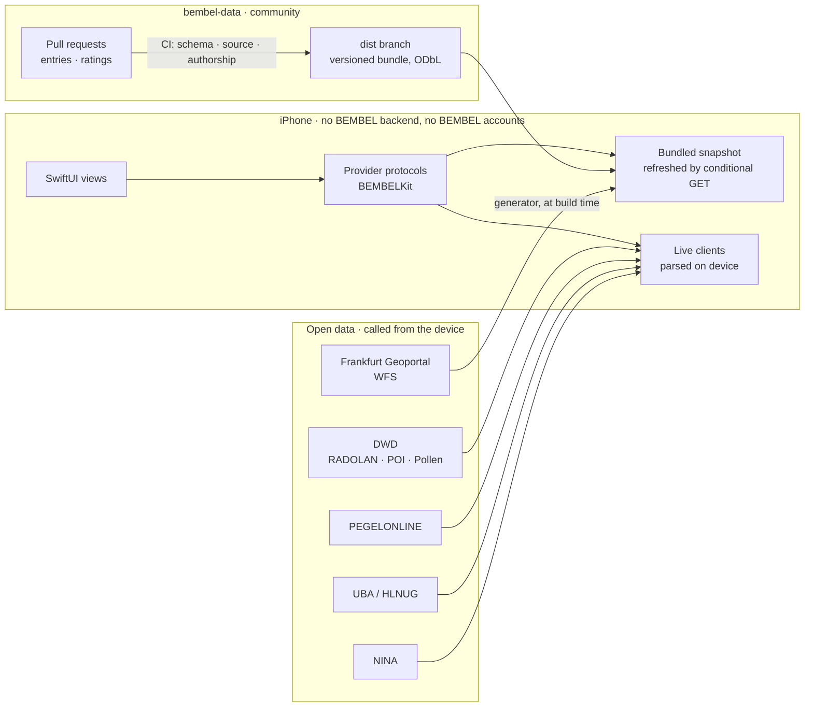

<h1 align="center">🍎 BEMBEL</h1>

<p align="center">
  <strong>Die kostenlose iPhone-App für Frankfurt und Rhein-Main.</strong><br/>
  <em>Für eine Stadt, die heißer wird — Wasser, Luft, Regen.</em>
</p>

<p align="center">
  <a href="https://github.com/maurice-jobst/bembel/actions/workflows/ci.yml"></a>
  <a href="https://github.com/maurice-jobst/bembel/actions/workflows/data-validate.yml"></a>
  <a href="https://github.com/maurice-jobst/bembel/actions/workflows/sources-liveness.yml"></a>
</p>

<p align="center">
  
  
  
  
  <a href="LICENSE"></a>
  
</p>

<p align="center">
  <a href="#-was-drin-ist">Features</a> ·
  <a href="#-der-held-bewertungen-als-pull-requests">The hero</a> ·
  <a href="#%EF%B8%8F-wie-die-daten-fließen">Architecture</a> ·
  <a href="#-zahlen-die-ci-nachrechnet">Checked numbers</a> ·
  <a href="#-wie-es-gebaut-wird">How it's built</a> ·
  <a href="#-wer-entscheidet">Governance</a> ·
  <a href="#-nachbarn-und-partner">Partners</a> ·
  <a href="#-selbst-bauen">Build</a>
</p>

---

Frankfurt already publishes what you need on a hot afternoon — where the
drinking water is, whether the rain is about to arrive, what the air and the
river are doing. It publishes it as WFS layers, bzip2 rasters and CSV, in
formats you cannot use while standing on a street corner. **BEMBEL puts it
in one place**, parsed on the device, with the source and the licence one
tap away.

No ads, no tracking, no BEMBEL backend, no BEMBEL accounts. The App Store
privacy label says **Data Not Collected**, and the architecture is why that
holds: there is nothing to send data to. Named after the Apfelwein jug —
grey salt-glazed stoneware, cobalt diamond relief.

## 📱 Was drin ist

| | Tab | What it does | Data, called from the device |
|---|---|---|---|
| 🥤 | **Orte** | **Wasserhäuschen** and **Ebbelwei-Wirtschaften** registers with Merkmale navigation, a provenance byline on every entry, a rating funnel and a coverage game — plus **73 Trinkbrunnen** with a seasonal state engine that knows the season starts on World Water Day and the historic fountains come back after Easter | [bembel-data](https://github.com/maurice-jobst/bembel-data) (ODbL) · Frankfurt Geoportal WFS · OSM |
| 🚋 | **Abfahrten** | RMV departures with Home and Lock Screen widgets — *gated:* no API key by 1 Dec 2026 and it leaves v1.0; [Transitous](docs/PARTNERS.md#approach-first) is the keyless second route | RMV Open Data · DELFI via Transitous |
| ☀️ | **Sonne** | Where the sun is right now and all day, with a time scrubber and a "Wie genau ist das?" disclosure — the NOAA ephemeris, cross-validated, with the refraction convention spelled out | computed on device |
| 🌧️ | **Regen** | The past hour and the next two, as real radar frames on the map: animated, scrubbable, with a colour-blind-safe rain scale — DWD RADOLAN parsed on the phone, bzip2 and all | DWD Open Data (RY + RV) |
| 🌡️ | **Stadt** | Main-Pegel, Luftqualität, Temperatur, Pollenflug, amtliche Warnungen — five cards, five independent failure states, so a dead river gauge never blanks the civil-protection card | PEGELONLINE · UBA/HLNUG · DWD · DWD · NINA |
| 🏷️ | Sticker | Datenspender, Verifizierer, Erste Bewertung — earned by merged pull requests — and Kiosk-Stempel from on-device visit detection, opt-in, never uploaded | contributors.json + local visits |

The **Schattenkarte** — an on-device shadow map over the Hessen LoD2
building model — is deliberately **not** in v1.0. Its geometry ships as a
published dataset; the rendering is the v1.2 headline
([ADR 0010](docs/adr/0010-portfolio-artefact-over-product.md)). Ship target
is **22 March 2027**, World Water Day, the day the fountains come back on.
The scope of record with a status per feature is
[docs/PRODUCT.md](docs/PRODUCT.md).

## 🥤 Der Held: Bewertungen als Pull Requests

The flagship is a community register that lives in git. Entries and ratings
for Wasserhäuschen and Ebbelwei-Wirtschaften arrive as pull requests to
[bembel-data](https://github.com/maurice-jobst/bembel-data); the app is the
top of that funnel.

- **Provenance over anonymity.** Every entry shows who verified it, when,
  and from which source. One tap opens its full GitHub history. Yelp cannot
  do that; a repository can.
- **One rating per account, enforced by CI.** A rating file is named after
  its author's login, and
  [`check_authorship.py`](https://github.com/maurice-jobst/bembel-data/blob/main/scripts/check_authorship.py)
  rejects any pull request touching a rating named for someone else.
  Maintainers get no proxy path around it.
- **The app is the funnel.** "Bewerten", "verifizieren" and "Ort melden"
  open prefilled GitHub flows for that exact kiosk — no account in the app,
  no token, no backend.
- **The room is not empty by design.** Unverified candidates render grey
  with a "hilf mit" call to action and per-Stadtteil progress. Right now
  the register is in its cold-start phase, and the app says so instead of
  hiding it.

## 🏗️ Wie die Daten fließen


```mermaid
flowchart LR
    subgraph community["bembel-data · community"]
        PR["Pull requests<br/>entries · ratings"] -->|"CI: schema · source · authorship"| DIST["dist branch<br/>versioned bundle, ODbL"]
    end
    subgraph open["Open data · called from the device"]
        DWD["DWD<br/>RADOLAN · POI · Pollen"]
        WSV["PEGELONLINE"]
        UBA["UBA / HLNUG"]
        NINA["NINA"]
        FFM["Frankfurt Geoportal<br/>WFS"]
    end
    subgraph phone["iPhone · no BEMBEL backend, no BEMBEL accounts"]
        V["SwiftUI views"] --> P["Provider protocols<br/>BEMBELKit"]
        P --> B["Bundled snapshot<br/>refreshed by conditional GET"]
        P --> L["Live clients<br/>parsed on device"]
    end
    DIST --> B
    FFM -->|"generator, at build time"| B
    DWD & WSV & UBA & NINA --> L
```

- **iOS 18.5+, Swift 6, SwiftUI, iPhone only.** A plain Xcode project with
  filesystem-synchronised groups, no generators, no third-party
  dependencies, German-first String Catalogs. Three targets: `BEMBEL`,
  `BEMBELWidgets`, and `BEMBELKit` — a local Swift package with the design
  system, navigation, region model, decoders and data layer that also
  compiles on macOS so tests run without a simulator.
- **No backend** ([ADR 0001](docs/adr/0001-no-backend-static-data.md)).
  Curated datasets are bundled and refreshed via conditional GET against a
  static manifest; live APIs are called straight from the device; every
  failure mode degrades to the last good data.
- **Provider seam** ([ADR 0007](docs/adr/0007-provider-seam.md)). Each
  feature reads a protocol from BEMBELKit; fixtures and live sources are
  interchangeable behind it. Going live is one line in one file, and every
  live source so far went live exactly that way.
- **Region model** ([ADR 0003](docs/adr/0003-region-model-rings-and-ags.md)).
  Three concentric rings keyed by AGS, generated from the Destatis
  Gemeindeverzeichnis, never hand-typed.

## 🔢 Zahlen, die CI nachrechnet

Numbers in READMEs rot. These three are recomputed from the registry by
`make validate`, and prose the check can no longer read fails the build.

Every upstream this app reads is in [`data/sources.json`](data/sources.json):
39 entries across the Frankfurt Geoportal, DWD, PEGELONLINE, the
Autobahn GmbH, Open Data Hessen, GBFS operators, Transitous and more — each
with its licence, polling cadence, the date a live request last proved it
works, and the gotchas that cost an hour. Sources are tiered 1–5 by what
access costs, and the tier is a claim the validator enforces: tier 1–2 must
be keyless, and a tier-5 entry records the search that found no API rather
than an endpoint. The tier-5 block is the part most registries leave out:
six things Frankfurt does *not* publish, written down so nobody spends
another afternoon looking.

```bash
make verify-sources   # calls all 52 endpoints, reports dead ones and collapsed feature counts
```

A [weekly job](.github/workflows/sources-liveness.yml) runs the same sweep
and files one issue when an upstream stops answering or a layer quietly
empties out. The same registry feeds *Einstellungen › Quellen* in the app,
so the licence screen cannot drift from the data either.

## 🤖 Wie es gebaut wird

AI agents write the implementation; a human reviews every pull request; CI
takes what a reviewer should not have to check by hand. That split — **AI at
the edges, deterministic core** — also decides technical questions: given
two options a human would rate the same, we take the one an agent can work
in safely ([ADR 0008](docs/adr/0008-ai-native-selection-principle.md)).
Concretely: rain radar parses DWD's binary composites on the device against
a 133 KB fixture checked into the repo, instead of calling a hosted wrapper
that would be a service in the critical path.

| Gate | What runs | Where |
|---|---|---|
| Format | `swift-format lint --strict`, bundled with Xcode | required check |
| Tests | `swift test` on BEMBELKit, native macOS, no simulator | required check |
| App build | `xcodebuild`, iOS Simulator, unsigned | required check |
| Data | schemas, generated-file byte equality, source URLs per row, tier rules, README numbers | required check |
| Validator | the validator's own tests — every rule watched failing once | same job |
| Upstreams | every registered endpoint called for real, drift against recorded counts | weekly |
| Community data | schema and authorship checks | bembel-data CI |
| Main | three required checks, up-to-date branch, `enforce_admins` on | branch protection |

[docs/AI-NATIVE.md](docs/AI-NATIVE.md) is the long version: which
constraints this repo accepted so that agent-written changes stay
reviewable, each pointing at the file or check that enforces it — and, in
its own section, what got through the gates anyway.

## 🧭 Wer entscheidet

A single maintainer, named review lanes, agents as authors, and a written
tie-breaker so scope questions are a lookup instead of a meeting.

| | |
|---|---|
| [GOVERNANCE.md](GOVERNANCE.md) | Roles, the three decision tiers, tie-breakers, change control on `main`, releases, and the governance gaps stated as such — bus factor one, review as practice rather than mechanism |
| [docs/PRODUCT.md](docs/PRODUCT.md) | Positioning, eleven principles with the ADR that decides each, the v1.0 scope of record with status, the dated gates, definition of ready and done, the roadmap to v1.5 |
| [docs/adr/](docs/adr/) | Ten decisions with rationale and cost, from "no backend" to "portfolio over product" |
| [docs/BACKLOG.md](docs/BACKLOG.md) | The epic-to-issue map; the [GitHub Issue](https://github.com/maurice-jobst/bembel/issues) is the ticket and the spec |
| [CONTRIBUTING.md](CONTRIBUTING.md) · [CODE_OF_CONDUCT.md](CODE_OF_CONDUCT.md) · [SECURITY.md](SECURITY.md) | How a change gets in, how people treat each other, how to report a vulnerability privately |

**Milestones:** M0 skeleton ✅ · M1 pipeline & geometry (Oct–Dec 2026) ·
M2 features (Dec–Feb) · M3 ship (March 2027) · M4 side quests after 1.0.
External TestFlight beta opens 31 Oct 2026 ([docs/TESTFLIGHT.md](docs/TESTFLIGHT.md)).

## 🤝 Nachbarn und Partner

BEMBEL is not the first project to care about Frankfurt's open data, and it
should not pretend to be. [docs/PARTNERS.md](docs/PARTNERS.md) lists thirty
verified neighbours — civic-tech groups, sibling apps, data stewards — with
a concrete angle for each. The five to approach first: **Transitous** (keyless
departures before the RMV gate), **trinkhallen-data** (an active Frankfurt
kiosk dataset to align identifiers with), the **Klimareferat** (owner of the
fountain data, 16 new fountains coming), the city's **Wasserhäusje-Tag**
(a sourceable seed set and the launch stage), and **CCC Frankfurt** (the
first public audience and a privacy read-through).

In return, BEMBEL has things to give: the only Swift RADOLAN decoder on
GitHub as far as a search can tell, a registry of 39 Rhein-Main upstreams
with a weekly liveness sweep, and the ratings-as-pull-requests pattern for
any city that wants to fork it.

## 🔨 Selbst bauen

Xcode 16.4+ (iOS 18.5 SDK). `BEMBELKit` also compiles for macOS, so
`swift test` runs natively without a simulator; there is no Mac app.

```bash
cp Config/Secrets.xcconfig.template Config/Secrets.xcconfig
# fill in BEMBEL_TEAM_ID for device builds; the file is gitignored — CI builds unsigned from the template
make build          # xcodebuild, iOS Simulator, no signing
make test           # BEMBELKit unit tests via swift test
make validate       # data schemas, mirror equality, registry rules, README numbers
make test-data      # the validator's own tests
make format         # swift-format, bundled with Xcode; run before pushing
make verify-sources # every registered upstream, called for real (needs the network)
```

<details>
<summary><strong>Repository map</strong></summary>

```
App/                 SwiftUI app: Features/{Places,Departures,Sun,Radar,City}, Onboarding, Settings
Widgets/             WidgetKit extension (departures, nearest candidate)
Packages/BEMBELKit/  Local package: Domain, Providers, Data/{Curated,Live,Radar,Pollen,BembelData},
                     Solar, Region, Community, Navigation, DesignSystem, Resources (bundled snapshots), Tests
data/                Curated datasets, the source registry, attribution, JSON schemas
scripts/             stdlib-only Python: generators, validator + tests, source verifier, snapshot sync
docs/                PRODUCT, PARTNERS, BACKLOG, AI-NATIVE, TESTFLIGHT, FEATURE-CATALOG, adr/, specs/, research/, history/
.github/             CI, data validation, weekly source liveness, CODEOWNERS, issue and PR templates
```

</details>

## 👥 Team und Lizenzen

Maintainer, PM and architecture: [@maurice-jobst](https://github.com/maurice-jobst).
Review lanes: app and widgets [@cybeerboy](https://github.com/cybeerboy);
data pipeline and CI [@jaypikay](https://github.com/jaypikay),
[@monsdroid](https://github.com/monsdroid). Most of the code is written by
AI agents under that direction and reviewed by a human; every agent commit
carries its trailer.

Code is [MIT](LICENSE). Bundled data carries its sources' licences,
attributed in [`data/ATTRIBUTION.json`](data/ATTRIBUTION.json) and rendered
in-app; OSM-derived datasets and the community register are ODbL
(share-alike). [ai-workbench](https://github.com/maurice-jobst/ai-workbench)
applies the same doctrine to knowledge work.

<p align="center"><sub>Frankfurt am Main · gebaut für den 22. März 2027 · 🍎</sub></p>
